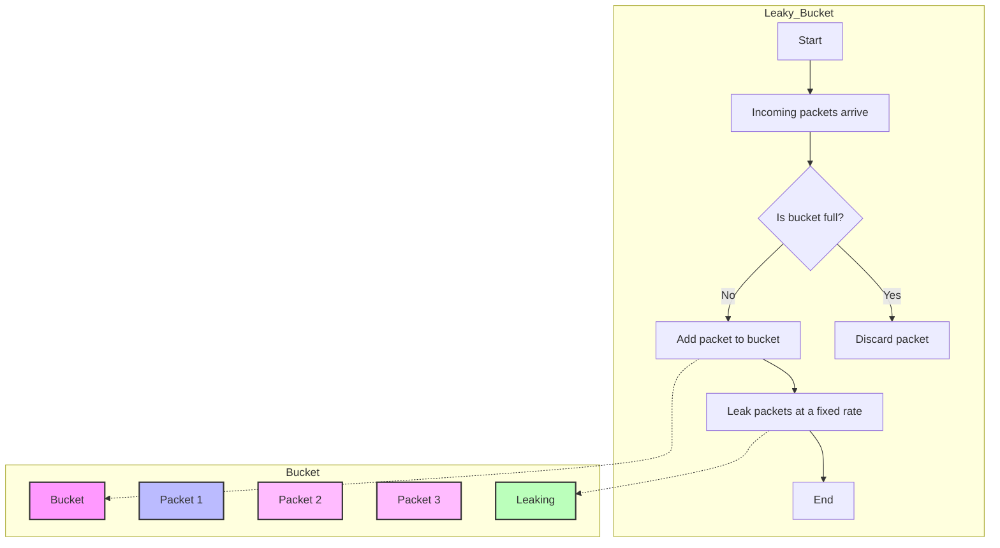
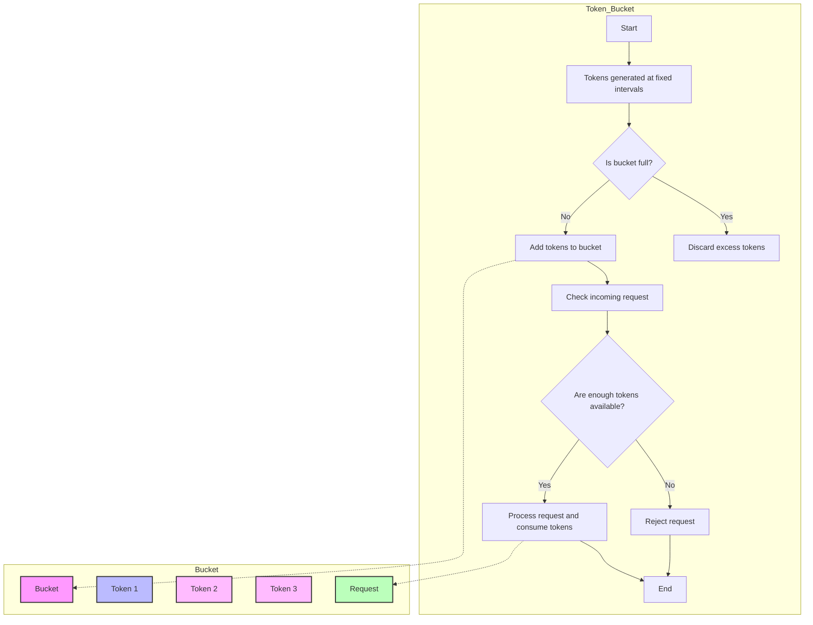
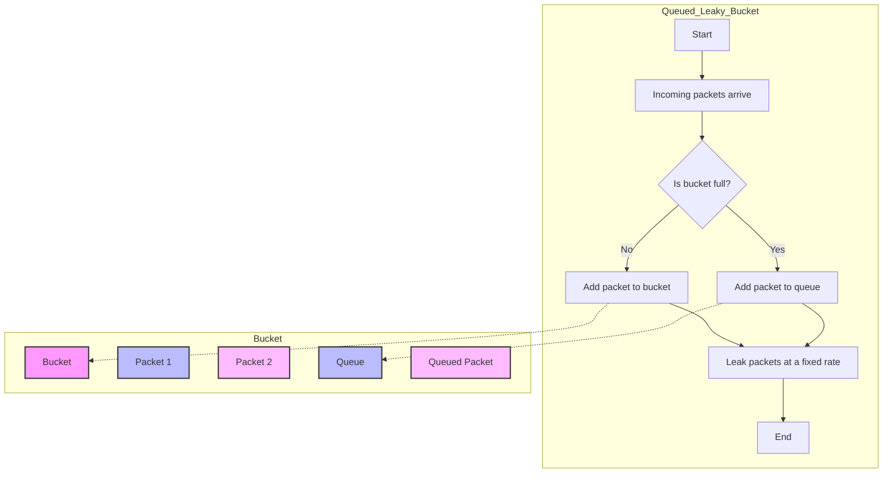
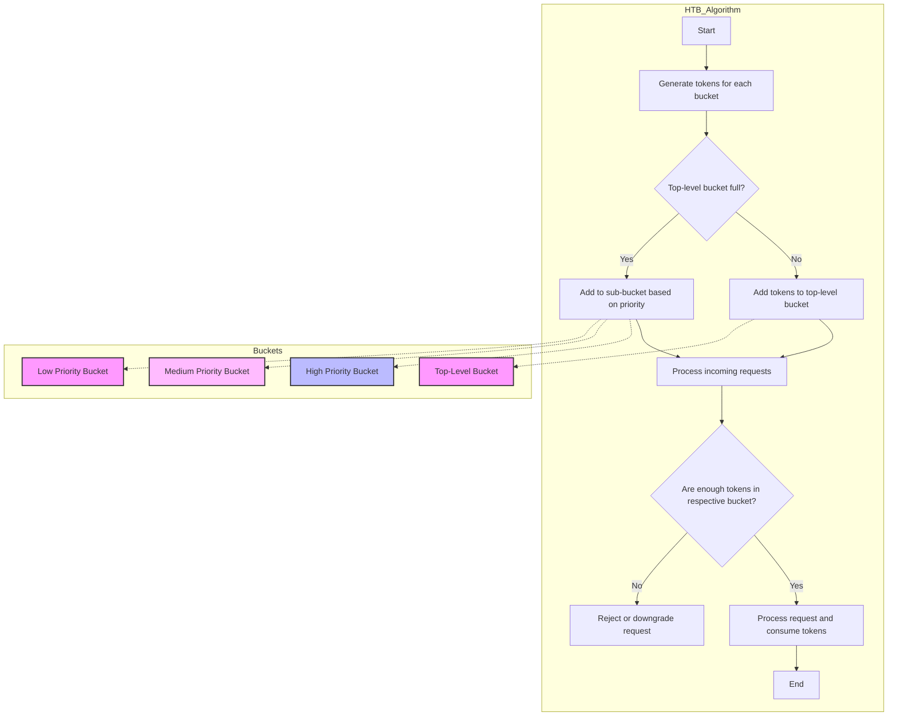
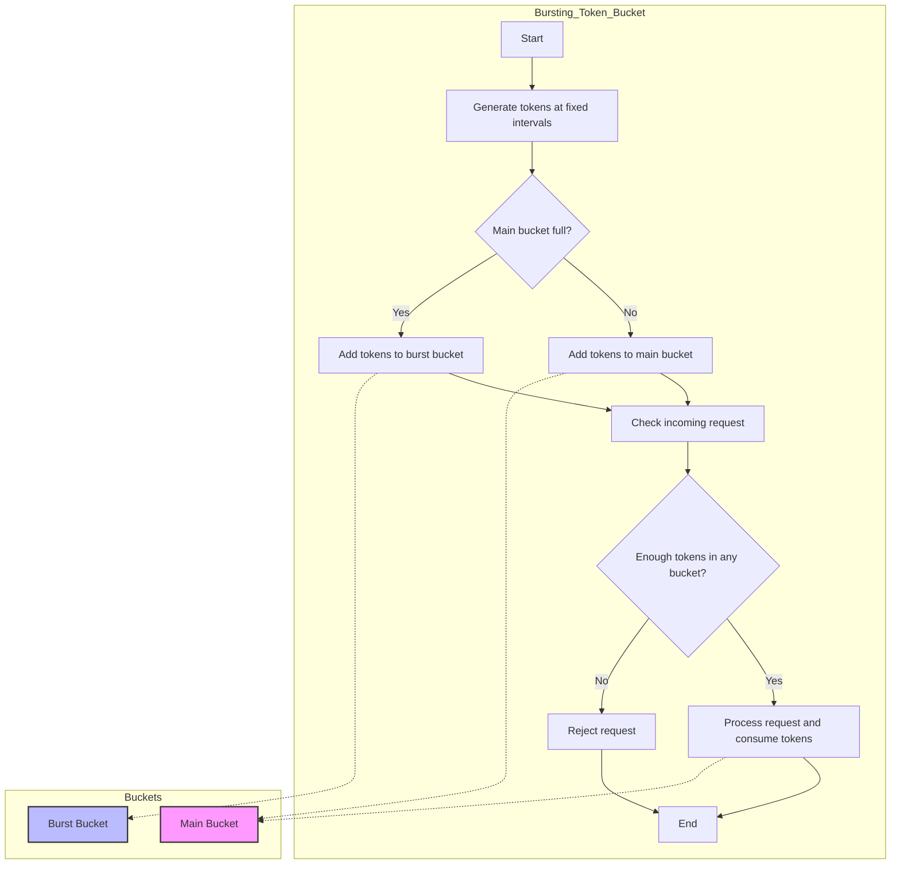
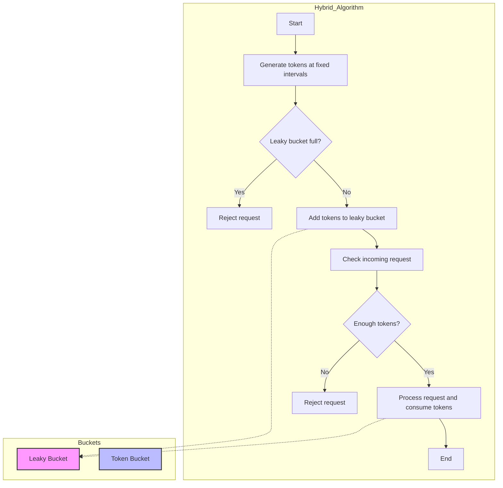

# Visual Guide to Leaky and Token Bucket Algorithms

This guide provides visual representations of various rate-limiting algorithms based on leaky buckets and token buckets using Mermaid charts. These algorithms control the flow of data in distributed systems by shaping traffic and preventing resource exhaustion. Each algorithm has a distinct method for managing the rate at which requests are allowed, making them crucial for ensuring system stability and preventing overload.

## 1. Leaky Bucket Algorithm

The leaky bucket algorithm controls the data flow by using a fixed-size bucket that leaks at a constant rate. Incoming packets are placed in the bucket if there’s space; otherwise, they are discarded.

## 2. Token Bucket Algorithm

In the token bucket algorithm, tokens are added to a bucket at a fixed rate. Requests are only allowed if there are enough tokens in the bucket, and tokens are consumed as requests pass through.

## 3. Leaky Bucket with Queue

This variant of the leaky bucket uses a queue to hold excess packets temporarily instead of discarding them.

## 4. Hierarchical Token Bucket (HTB)

The hierarchical token bucket algorithm is used in scenarios where multiple rate limits are applied based on different priorities. Buckets are nested to enforce hierarchical constraints.

## 5. Token Bucket with Bursting

This variant allows temporary bursts by storing extra tokens in a secondary bucket.

## 6. Hybrid Leaky-Token Bucket

The hybrid leaky-token bucket algorithm combines both mechanisms, using the leaky bucket to regulate flow and the token bucket to allow short bursts.

This guide provides a detailed visualization of the different variations of leaky and token bucket algorithms, making it easier to understand their mechanisms and their use cases in network rate limiting and traffic management.
